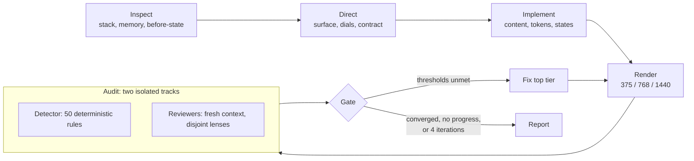

<div align="center">

# lexia-design

**A design OS for coding agents.**

One entry point that turns a request into a distinctive, accessible,
production-ready interface, then audits its own work and reports the score.

[](https://github.com/lexsantor/lexia-design/actions/workflows/ci.yml)
[](CHANGELOG.md)
[](LICENSE)
[](#install)
[](scripts)
[](#detector)
[](references/accessibility/wcag-checklist.md)

```
/lexia-design  build a pricing page for <product>
```

</div>

---

## Why this exists

Coding agents produce interfaces that work and look like every other
interface: purple gradient, centered hero, three identical cards, fabricated
testimonials, an animation on every section. The failure is not taste. It is
that nothing in the loop commits to a direction, checks the result against
evidence, or refuses to ship a claim that is not true.

lexia-design adds that loop: a direction contract with falsifiable
commitments, a deterministic detector, fresh-context reviewers, a bounded
convergence cycle, and a report that cannot hide a blocker behind a number.

> [!IMPORTANT]
> The plugin optimizes in a fixed priority order. When two principles
> collide, the lower number wins.
>
> `1` user's objective &nbsp;·&nbsp; `2` clarity and usability &nbsp;·&nbsp;
> `3` accessibility &nbsp;·&nbsp; `4` content truthfulness &nbsp;·&nbsp;
> `5` system coherence &nbsp;·&nbsp; `6` performance &nbsp;·&nbsp;
> `7` visual identity &nbsp;·&nbsp; `8` distinction &nbsp;·&nbsp;
> `9` motion &nbsp;·&nbsp; `10` implementation convenience
>
> One exception: an explicit brief commitment outranks the plugin's taste.
> It never outranks usability evidence, accessibility, content truth or
> arithmetic.

---

## The cycle



The loop is bounded on purpose. Four iterations, a measurable stop condition,
and an honest report when thresholds are not met. Open-ended self-QA spends
the user's budget without converging.

---

## The report

Every run ends with the same artifact, whatever the verdict. Blockers first,
never the score. Real output:

```
> No blocking issues open.

LEXIA SCORE: 83.1 / 100 - B (Ship with named follow-ups)
```

| | |
|---|---|
| Iteration | 4 |
| Coverage | 4 lenses + trust surface, rendered 375/768/1440 |
| Dimensions scored | 14 of 15 |
| Delta vs previous | +0.29 |

| # | Dimension | Score | Weight | Points | Δ | Evidence |
|---|---|---|---|---|---|---|
| 3 | USABILITY | 8/10 | 10 | 8.0 | 0 | primary flow walked, 4 steps |
| 4 | ACCESSIBILITY | 9/10 | 10 | 9.0 | +1.5 | keyboard walk complete; 12 pairs measured |
| 12 | DISTINCTIVENESS | 7.5/10 | 6 | 4.5 | 0 | subjective: signature move visible in hero |
| 13 | MOTION_QUALITY | n/a | 4 | — | — | zero-motion register, documented |
| | **TOTAL (applicable)** | | 101 | **83.1** | | |

### How the number is built, and why it cannot lie

The composite is a weighted mean over the fifteen dimensions, renormalized
across the ones that apply, so an `n/a` neither helps nor hurts. Weights
follow the priority order above.

| Weight | Dimensions |
|:--:|---|
| **10** | usability, accessibility |
| **9** | task clarity, content integrity |
| **7** | information architecture, visual hierarchy, responsiveness, production readiness |
| **6** | typography, color and contrast, system coherence, distinctiveness, performance |
| **5** | spacing and rhythm |
| **4** | motion quality |

Then it is capped, and a capped score always shows the raw value it came from:

| Condition | Ceiling |
|---|:--:|
| Unverified fabricated content | **49** |
| Critical accessibility or usability issue, or failing build | **59** |
| Visual regression against the previous iteration | **79** |
| Not visually verified (nothing rendered) | **89** |

Bands: `90+` A ship &nbsp;·&nbsp; `80-89` B ship with named follow-ups
&nbsp;·&nbsp; `70-79` C usable, material gaps &nbsp;·&nbsp; `60-69` D not
ready &nbsp;·&nbsp; `<60` F blocked.

> [!WARNING]
> The score is a weighted opinion, not a measurement. Compare it only across
> equal coverage: a deeper audit scoring lower than a shallower one is not a
> regression, and the gate says so out loud. Read the blockers and the
> evidence column before the number.

---

## Install

<table>
<tr>
<th align="left" width="50%">Claude Code</th>
<th align="left" width="50%">Try without installing</th>
</tr>
<tr valign="top">
<td>

```bash
git clone https://github.com/lexsantor/lexia-design
claude plugin validate ./lexia-design
```

Then inside a session:

```
/plugin marketplace add ./lexia-design
/plugin install lexia-design@lexia
```

</td>
<td>

```bash
claude --plugin-dir ./lexia-design
```

Reload after edits: `/reload-plugins`<br/>
List installed: `claude plugin list`<br/>
Remove: `claude plugin uninstall lexia-design`

</td>
</tr>
</table>

Requires Node 18+ on `PATH` for the hooks and scripts. On native Windows,
Git for Windows is recommended.

---

## Use

```
/lexia-design                build a pricing page for <product>
/lexia-design                improve the dashboard in ./app
/lexia-design:design-audit   src/
/lexia-design:design-system
/lexia-design:motion-design  review the animations in src/components
/lexia-design:update
```

The orchestrator also activates on natural requests ("design a landing page",
"audit this UI", "why does this look AI-generated", "add scroll animations")
and stays out of backend, data and infra work.

---

## What is inside

<table>
<tr>
<th align="left" width="50%">Skills</th>
<th align="left" width="50%">Agents</th>
</tr>
<tr valign="top">
<td>

`lexia-design` orchestrator<br/>
`design-system` direction and tokens<br/>
`design-audit` verdicts and scoring<br/>
`motion-design` what moves, what must not<br/>
`update` controlled source refresh

</td>
<td>

`design-director` direction, contract fidelity<br/>
`ux-auditor` heuristics, WCAG, states<br/>
`visual-critic` hierarchy, type, distinctiveness<br/>
`motion-engineer` timing, interruption, cleanup

</td>
</tr>
</table>

<details>
<summary><b>Knowledge base</b> (references loaded on demand)</summary>

<br/>

| Area | Contents |
|---|---|
| **Heuristics** | Nielsen operationalized, Fitts, Hick, Jakob, Tesler, Doherty, peak-end, cognitive load, Gestalt, plus a layout failure catalog and an application map per surface type |
| **Accessibility** | WCAG 2.2 AA gate (verified: 3.3.3 is AA, 2.3.3 is AAA, 2.5.8 with its five exceptions), focus and keyboard, the APG's 30 patterns, forms and the seven interface states, i18n correctness |
| **Motion** | Frequency gate, duration bands, easing tokens, interruptibility, reduced motion, the technology ladder, and a GSAP 3.15 playbook |
| **Anti-slop** | Pattern registry framed as defaults not bans, copy rules including syntactic tells, and a model-priors file with a convergence-breaking procedure |
| **Visual directions** | Twelve direction territories, each with falsifiable "breaks if" commitments, plus the direction protocol and adjective translation |
| **Production** | Trust surface and GDPR Art. 13 launch gate, timezone-safe date logic, structure patterns, generated-asset pipelines |
| **Component libraries** | Ten-point vetting checklist, registration contract, and a verified catalog with licensing status |

</details>

<details>
<summary><b>Field learnings</b> (how the rules got hard)</summary>

<br/>

Rules earn their place with evidence, not taste. `docs/learnings/` holds the
harvest that hardened this plugin: a full audit-and-fix cycle on a production
clinical SaaS, and a 141-entry database distilled from four project logs.
Every entry carries its evidence grade.

| Grade | Meaning | Entries |
|---|---|:--:|
| `field` | A defect that shipped, or a decision paid for in a real project | 106 |
| `asserted` | Stated without evidence; kept only when falsifiable | 26 |
| `derived` | A vague assertion turned into a testable threshold | 8 |
| `measured` | Carries an external number | 1 |

</details>

---

## Detector

Fifty deterministic rules over UI files. Zero dependencies, no AST, no
network. It finds mechanical violations and never rewrites code.

```bash
node scripts/lexia-design-audit.mjs src/components/Hero.tsx
node scripts/lexia-design-audit.mjs --deep src --format json
node scripts/lexia-design-audit.mjs --list-rules
```

| Family | Catches, for example |
|---|---|
| `a11y/*` | zoom disabled, paste blocked, clickable divs, focus outline removed with no replacement, tablist without panels, reveal wrapper over legal content |
| `motion/*` | `transition: all`, layout-property transitions, `scale(0)` entrances, blur in entrances, press without transform, missing reduced-motion guard, LCP behind a reveal, counters resting at zero |
| `slop/*` | purple-blue gradient, emoji as icons, eyebrow density, card density, negative parallelism |
| `content/*` | fabricated metrics, star-rated testimonials, buzzword copy, lorem ipsum, placeholder markers |
| `system/*` | off-token colors, hardcoded shadows, near-duplicate tokens, an accent that is functionally ink, theme-toggle desync, color tokens missing the alpha placeholder |
| `i18n/*` | provider without an explicit locale, locale switcher on soft navigation, hardcoded locale segments |
| `correctness/*` `ux/*` `layout/*` `perf/*` | server-local midnight in "today" logic, native `confirm()`, `order` with asymmetric grid tracks, broad `will-change` |

> [!NOTE]
> A flag is a signal, not a verdict. Every finding is verified before it is
> acted on: `TRUE_POSITIVE`, `MITIGATED` or `FALSE_POSITIVE`. Deliberate
> deviations are waived inline and recorded in the decision log:
>
> ```js
> // lexia-disable-next-line slop/eyebrow-density -- section index is the nav model
> ```

---

## Scoring and gate

```bash
node scripts/lexia-design-score.mjs init                        # scaffold .lexia-design/
node scripts/lexia-design-score.mjs gate --scores scores.json   # gate + write the report
node scripts/lexia-design-score.mjs gate --scores s.json --format report
node scripts/lexia-design-score.mjs report                      # print the last report
node scripts/lexia-design-score.mjs weights                     # weights, caps, bands
node scripts/lexia-design-score.mjs history                     # score trend
```

Defaults: four iterations maximum, mean 8.5, distinctiveness 7.5, zero
critical accessibility or usability issues, zero visual regressions. Override
per project in `.lexia-design/project-preferences.json`.

---

## Project memory

The system cannot retrain itself, so it learns operationally through files
that live with the project and stay auditable by a human.

```
.lexia-design/
├── DESIGN-BRIEF.md            direction, dials, anti-references, signature move
├── DESIGN-SYSTEM.md           tokens, contract with its breaks-if list, externals
├── DESIGN-AUDIT.md            findings with verdicts and evidence
├── DESIGN-REPORT.md           the /100 table
├── decisions.jsonl            decisions, waivers, preferences, with scope
├── rejected-patterns.jsonl    what was tried and refused, and why
├── evaluation-history.jsonl   every iteration, score, coverage and verdict
└── project-preferences.json   thresholds and dial overrides
```

A single project's outcome never becomes a universal rule automatically.
Scope is recorded explicitly: project preference, user preference, evaluation
result, general rule, or open hypothesis.

---

## Hooks

| Event | Behavior |
|---|---|
| `PostToolUse` | Audits only the UI file just written and returns findings as context. Always exits 0. Never blocks. |
| `Stop` | Reminds about unresolved critical findings, only in projects that already have a `.lexia-design/` directory. |

Disable for a session with `LEXIA_DESIGN_HOOKS=0`, or entirely with
`claude plugin disable lexia-design`.

---

## Development

```bash
node evals/run-evals.mjs --smoke     # offline: cases, structure, detector self-test
claude plugin validate .
```

The smoke suite runs the detector against fixtures that encode known defects
and asserts every expected rule fires, plus a clean fixture that must produce
no serious findings. A detector rule without a fixture is not done. See
[CONTRIBUTING.md](CONTRIBUTING.md).

---

## Knowledge sources

Built as an original synthesis. No third-party code, datasets, fonts,
components or brand assets are bundled. Every source studied is recorded in
[SOURCES.md](SOURCES.md) with its license, the exact commit consulted, the
principles extracted and what was deliberately excluded; versions are pinned
in `sources.lock.json`.

`/lexia-design:update` compares those pins against upstream using metadata
only, writes a proposal, runs the evals, and waits for human approval. It
never updates silently and never executes fetched code.

---

## Known limitations

Read [LIMITATIONS.md](LIMITATIONS.md) before relying on this for production
work. The short version: rendering depends on the environment and the plugin
refuses to score what it did not see; the detector is regex-based, so it is a
tripwire and not a certifier; and the score is judgment with arithmetic
applied to it, not measurement.

---

<div align="center">

MIT · Built by [Taller24](https://github.com/lexsantor)

</div>
