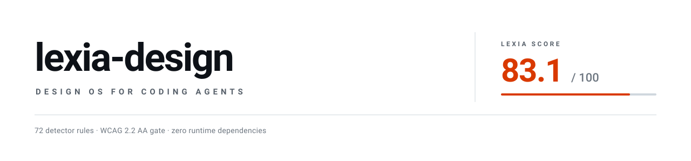

<div align="center">

<picture>
  <source media="(prefers-color-scheme: dark)" srcset=".github/assets/banner-dark.svg">
  
</picture>

<br/>

[](https://github.com/lexsantor/lexia-design/actions/workflows/ci.yml)
[](CHANGELOG.md)
[](LICENSE)
[](#install)
[](scripts)

<br/>

**[What it does](#what-it-does)** &nbsp;·&nbsp;
**[The report](#the-report)** &nbsp;·&nbsp;
**[Install](#install)** &nbsp;·&nbsp;
**[How it works](#how-it-works)** &nbsp;·&nbsp;
**[Inside](#inside)** &nbsp;·&nbsp;
**[Limits](#limits)**

</div>

<br/>

## What it does

Coding agents ship interfaces that work and look identical to every other
interface. The failure is not taste. Nothing in the loop commits to a
direction, checks the result against evidence, or refuses to ship a claim
that is not true.

lexia-design adds that loop.

<table>
<tr>
<td width="33%" valign="top">

**Commits to a direction**

A contract with falsifiable
commitments, not mood words.
Twelve territories, each with
a "breaks if" list an audit
can check.

</td>
<td width="33%" valign="top">

**Checks its own work**

Fifty-seven deterministic rules plus
fresh-context reviewers, in
isolated tracks. Every finding
verified before it is acted on.

</td>
<td width="33%" valign="top">

**Reports a score it cannot game**

One number out of 100, capped
so a blocker can never hide
behind it, with the evidence
beside every dimension.

</td>
</tr>
</table>

> [!IMPORTANT]
> When two principles collide, the lower number wins.
>
> **1** user's objective &nbsp;·&nbsp; **2** clarity and usability &nbsp;·&nbsp;
> **3** accessibility &nbsp;·&nbsp; **4** content truthfulness &nbsp;·&nbsp;
> **5** system coherence &nbsp;·&nbsp; **6** performance &nbsp;·&nbsp;
> **7** visual identity &nbsp;·&nbsp; **8** distinction &nbsp;·&nbsp;
> **9** motion &nbsp;·&nbsp; **10** implementation convenience
>
> An explicit brief outranks the plugin's taste. It never outranks usability
> evidence, accessibility, content truth or arithmetic.

<br/>

## The report

Every run ends with the same artifact, whatever the verdict. Blockers first,
never the score.

<table>
<tr><td>

```
> No blocking issues open.

LEXIA SCORE: 83.1 / 100 — B (Ship with named follow-ups)
```

| | |
|---|---|
| Coverage | 4 lenses + trust surface, rendered 375/768/1440 |
| Dimensions scored | 14 of 15 |
| Delta vs previous | +0.29 |

| # | Dimension | Score | Weight | Points | Δ | Evidence |
|---|---|---|---|---|---|---|
| 3 | USABILITY | 8/10 | 10 | 8.0 | 0 | primary flow walked, 4 steps |
| 4 | ACCESSIBILITY | 9/10 | 10 | 9.0 | +1.5 | keyboard walk; 12 pairs measured |
| 12 | DISTINCTIVENESS | 7.5/10 | 6 | 4.5 | 0 | subjective: signature move in hero |
| 13 | MOTION_QUALITY | n/a | 4 | — | — | zero-motion register, documented |
| | **TOTAL (applicable)** | | 101 | **83.1** | | |

</td></tr>
</table>

<details>
<summary><b>How the number is built, and why it cannot lie</b></summary>

<br/>

A weighted mean over the fifteen dimensions, renormalized across the ones
that apply, so an `n/a` neither helps nor hurts. Weights follow the priority
order above.

| Weight | Dimensions |
|:--:|---|
| **10** | usability, accessibility |
| **9** | task clarity, content integrity |
| **7** | information architecture, visual hierarchy, responsiveness, production readiness |
| **6** | typography, color and contrast, system coherence, distinctiveness, performance |
| **5** | spacing and rhythm |
| **4** | motion quality |

Then it is capped. A capped score always prints the raw value it came from.

| Condition | Ceiling |
|---|:--:|
| Unverified fabricated content | **49** |
| Critical accessibility or usability issue, or failing build | **59** |
| Visual regression against the previous iteration | **79** |
| Not visually verified (nothing rendered) | **89** |

`90+` A ship &nbsp;·&nbsp; `80-89` B ship with named follow-ups &nbsp;·&nbsp;
`70-79` C usable, material gaps &nbsp;·&nbsp; `60-69` D not ready
&nbsp;·&nbsp; `<60` F blocked

The score is a weighted opinion, not a measurement. Compare it only across
equal coverage: a deeper audit scoring lower than a shallower one is not a
regression, and the gate says so out loud.

</details>

<br/>

## Install

```bash
# 1. clone
git clone https://github.com/lexsantor/lexia-design

# 2. verify
claude plugin validate ./lexia-design
```

```
# 3. install, inside a Claude Code session
/plugin marketplace add ./lexia-design
/plugin install lexia-design@lexia
```

<details>
<summary><b>Try it without installing, and other commands</b></summary>

<br/>

```bash
claude --plugin-dir ./lexia-design     # single session, nothing installed
```

| Action | Command |
|---|---|
| Reload after editing plugin files | `/reload-plugins` |
| List installed plugins | `claude plugin list` |
| Uninstall | `claude plugin uninstall lexia-design` |
| Remove the marketplace | `/plugin marketplace remove lexia` |
| Turn hooks off for a session | `LEXIA_DESIGN_HOOKS=0` |

Requires Node 18+ on `PATH` for the hooks and scripts. On native Windows,
Git for Windows is recommended.

</details>

<br/>

## Use

```
/lexia-design                build a pricing page for <product>
/lexia-design                improve the dashboard in ./app
/lexia-design:design-audit   src/
/lexia-design:design-system
/lexia-design:motion-design  review the animations in src/components
/lexia-design:update
```

It also activates on natural requests: *design a landing page*, *audit this
UI*, *why does this look AI-generated*, *add scroll animations*. It stays out
of backend, data and infra work.

<br/>

## How it works


The loop is bounded on purpose: four iterations, a measurable stop condition,
and an honest report when thresholds are not met. Open-ended self-QA spends
the user's budget without converging.

<br/>

## Inside

<table>
<tr>
<th align="left" width="50%">Skills</th>
<th align="left" width="50%">Agents</th>
</tr>
<tr valign="top">
<td>

`lexia-design` &nbsp;orchestrator<br/>
`design-system` &nbsp;direction and tokens<br/>
`design-audit` &nbsp;verdicts and scoring<br/>
`motion-design` &nbsp;what moves, what must not<br/>
`update` &nbsp;controlled source refresh

</td>
<td>

`design-director` &nbsp;direction, contract fidelity<br/>
`ux-auditor` &nbsp;heuristics, WCAG, states<br/>
`visual-critic` &nbsp;hierarchy, type, distinctiveness<br/>
`motion-engineer` &nbsp;timing, interruption, cleanup

</td>
</tr>
</table>

<details>
<summary><b>Detector</b> — 72 rules, zero dependencies, never rewrites code</summary>

<br/>

```bash
node scripts/lexia-design-audit.mjs src/components/Hero.tsx
node scripts/lexia-design-audit.mjs --deep src --format json
node scripts/lexia-design-audit.mjs --list-rules
```

| Family | Catches, for example |
|---|---|
| `a11y/*` | zoom disabled, paste blocked, clickable divs, focus outline removed with no replacement, tablist without panels, reveal wrapper over legal content |
| `motion/*` | `transition: all`, layout-property transitions, `scale(0)` entrances, blur in entrances, press without transform, missing reduced-motion guard, LCP behind a reveal, counters resting at zero |
| `slop/*` | purple-blue gradient, emoji as icons, eyebrow density, card density, negative parallelism, reframe setups and headings, template section order, uniform reveals |
| `content/*` | fabricated metrics, star-rated testimonials, buzzword copy, lorem ipsum, loud [PENDING] placeholders, assistant chatter, model-disclaimer leaks, engagement bait, puffery, dead metaphors, entity aliasing, claim repetition, stock faces on testimonials, unlabeled simulations |
| `system/*` | off-token colors, hardcoded shadows, near-duplicate tokens, an accent that is functionally ink, theme-toggle desync, color tokens missing the alpha placeholder |
| `i18n/*` | provider without an explicit locale, locale switcher on soft navigation, hardcoded locale segments |
| `correctness/*` `ux/*` `layout/*` `perf/*` | server-local midnight in "today" logic, native `confirm()`, `order` with asymmetric grid tracks, broad `will-change` |

A flag is a signal, not a verdict. Every finding is verified before it is
acted on: `TRUE_POSITIVE`, `MITIGATED` or `FALSE_POSITIVE`. Deliberate
deviations are waived inline and recorded in the decision log.

```js
// lexia-disable-next-line slop/eyebrow-density -- section index is the nav model
```

</details>

<details>
<summary><b>Knowledge base</b> — references loaded on demand</summary>

<br/>

| Area | Contents |
|---|---|
| **Heuristics** | Nielsen operationalized, Fitts, Hick, Jakob, Tesler, Doherty, peak-end, cognitive load, Gestalt, a layout failure catalog, and an application map per surface type |
| **Accessibility** | WCAG 2.2 AA gate (verified: 3.3.3 is AA, 2.3.3 is AAA, 2.5.8 with its five exceptions), focus and keyboard, the APG's 30 patterns, forms and the seven interface states, i18n correctness |
| **Motion** | Frequency gate, duration bands, easing tokens, interruptibility, reduced motion, the technology ladder, and a GSAP 3.15 playbook |
| **Anti-slop** | Pattern registry framed as defaults not bans, copy rules including syntactic tells, and model priors with a convergence-breaking procedure |
| **Visual directions** | Twelve territories, each with falsifiable "breaks if" commitments, plus the direction protocol and adjective translation |
| **Production** | Trust surface and GDPR Art. 13 launch gate, timezone-safe date logic, structure patterns, generated-asset pipelines |
| **Component libraries** | Ten-point vetting checklist, registration contract, and a verified catalog with licensing status |

</details>

<details>
<summary><b>Project memory</b> — how it learns without retraining</summary>

<br/>

```
.lexia-design/
├── DESIGN-BRIEF.md            direction, dials, anti-references, signature move
├── DESIGN-SYSTEM.md           tokens, contract with its breaks-if list, externals
├── DESIGN-AUDIT.md            findings with verdicts and evidence
├── DESIGN-REPORT.md           the /100 table
├── decisions.jsonl            decisions, waivers, preferences, with scope
├── rejected-patterns.jsonl    what was tried and refused, and why
├── evaluation-history.jsonl   every iteration, score, coverage and verdict
└── project-preferences.json   thresholds and dial overrides
```

A single project's outcome never becomes a universal rule automatically.
Scope is recorded explicitly: project preference, user preference, evaluation
result, general rule, or open hypothesis.

```bash
node scripts/lexia-design-score.mjs init      # scaffold the directory
node scripts/lexia-design-score.mjs history   # score trend across iterations
```

</details>

<details>
<summary><b>Hooks</b> — advisory, never blocking</summary>

<br/>

| Event | Behavior |
|---|---|
| `PostToolUse` | Audits only the UI file just written and returns findings as context. Always exits 0. |
| `Stop` | Reminds about unresolved critical findings, only in projects that already have a `.lexia-design/` directory. |

Disable for a session with `LEXIA_DESIGN_HOOKS=0`, or entirely with
`claude plugin disable lexia-design`.

</details>

<details>
<summary><b>Field learnings</b> — how the rules got hard</summary>

<br/>

Rules earn their place with evidence, not taste. `docs/learnings/` holds the
harvest: a full audit-and-fix cycle on a production clinical SaaS, and a
141-entry database distilled from four project logs. Every entry carries its
evidence grade.

| Grade | Meaning | Entries |
|---|---|:--:|
| `field` | A defect that shipped, or a decision paid for in a real project | 106 |
| `asserted` | Stated without evidence; kept only when falsifiable | 26 |
| `derived` | A vague assertion turned into a testable threshold | 8 |
| `measured` | Carries an external number | 1 |

</details>

<br/>

## Development

```bash
node evals/run-evals.mjs --smoke     # offline: cases, structure, detector self-test
claude plugin validate .
```

The smoke suite runs the detector against fixtures that encode known defects
and asserts every expected rule fires, plus a clean fixture that must produce
no serious findings. **A detector rule without a fixture is not done.** See
[CONTRIBUTING.md](CONTRIBUTING.md).

<br/>

## Limits

Read [LIMITATIONS.md](LIMITATIONS.md) before relying on this for production
work.

| | |
|---|---|
| **Rendering** | Depends on the environment. The plugin refuses to score what it did not see and marks those dimensions `n/a`. |
| **Detector** | Regex-based, not an AST. A tripwire, not a certifier. |
| **Score** | Judgment with arithmetic applied to it. Not a measurement. |

<br/>

## Sources

Built as an original synthesis. No third-party code, datasets, fonts,
components or brand assets are bundled. Every source studied is recorded in
[SOURCES.md](SOURCES.md) with its license, the exact commit consulted, the
principles extracted and what was deliberately excluded; versions are pinned
in `sources.lock.json`.

`/lexia-design:update` compares those pins against upstream using metadata
only, writes a proposal, runs the evals, and waits for human approval. It
never updates silently and never executes fetched code.

<br/>

---

<div align="center">
<sub>

MIT · [lexsantor](https://github.com/lexsantor)

</sub>
</div>
